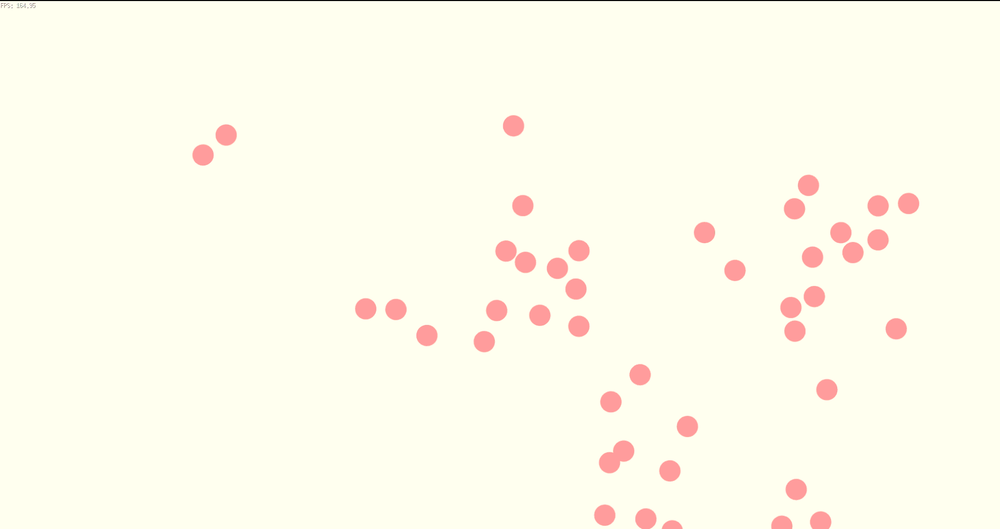

# Boids Flocking Simulation in Go

A high-performance implementation of the Boids flocking algorithm built with Go and Ebiten.

This project simulates emergent flocking behavior using simple local rules. Each boid follows a set of behaviors that, when combined, create realistic group movement patterns similar to bird flocks, fish schools, and swarm systems.

## Features

* Real-time flocking simulation
* Alignment behavior
* Cohesion behavior
* Separation behavior
* Center attraction system
* Custom 2D vector mathematics library
* Ebiten-based rendering
* Performance-focused optimization techniques
* Scalable architecture for large boid counts

## Boid Behaviors

### Alignment

Steers a boid toward the average heading of nearby boids.

### Cohesion

Steers a boid toward the center of nearby boids.

### Separation

Prevents boids from crowding each other by maintaining personal space.

### Centralization

Encourages boids to remain within a designated simulation area.

## Tech Stack

* Go
* Ebiten
* Custom Vector Mathematics

## Project Structure

```text
.
├── boid/
│   ├── boid.go
│   └── game.go
├── vector/
│   └── vector.go
└── main.go
```

## Running the Project

### Clone the repository

```bash
git clone https://github.com/swayam5342/boid
cd boid
```

### Install dependencies

```bash
go mod tidy
```

### Run

```bash
go run .
```

## How It Works

Every frame:

1. Each boid searches for nearby neighbors.
2. Alignment, cohesion, and separation forces are calculated.
3. Steering forces are combined.
4. Velocity is updated.
5. Position is updated.
6. The simulation is rendered.

Although every boid follows simple local rules, complex flocking behavior emerges naturally from the interactions between agents.

## Demo

<p align="center">
  
</p>

## Performance Considerations

The naive implementation uses neighbor searches between all boids, resulting in O(n²) complexity.

Optimizations explored during development include:

* Squared-distance calculations
* Single-pass neighbor processing
* Reduced allocations
* Spatial partitioning (future enhancement)
* Parallel updates (future enhancement)

## Future Improvements

* Spatial Hash Grid
* Quadtree implementation
* Multithreaded updates
* Boid rotation based on velocity
* Predator and prey behaviors
* Obstacles and path avoidance
* GPU-based rendering
* ECS architecture

## Learning Outcomes

This project demonstrates how complex systems can emerge from simple rules and serves as an introduction to simulation programming, game development, optimization, and computational geometry.

## License

MIT License
